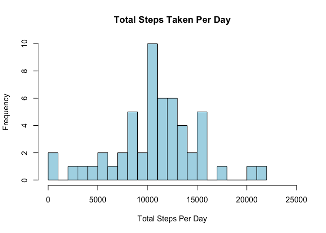

## Loading libraries

```r
library(tidyverse)
```

```
## ── Attaching core tidyverse packages ──────────────────────── tidyverse 2.0.0 ──
## ✔ dplyr     1.1.0     ✔ readr     2.1.4
## ✔ forcats   1.0.0     ✔ stringr   1.5.0
## ✔ ggplot2   3.4.1     ✔ tibble    3.1.8
## ✔ lubridate 1.9.2     ✔ tidyr     1.3.0
## ✔ purrr     1.0.1     
## ── Conflicts ────────────────────────────────────────── tidyverse_conflicts() ──
## ✖ dplyr::filter() masks stats::filter()
## ✖ dplyr::lag()    masks stats::lag()
## ℹ Use the ]8;;http://conflicted.r-lib.org/conflicted package]8;; to force all conflicts to become errors
```

## Loading and preprocessing the data

```r
data <- read.csv("activity.csv")
```


## 1. What is mean total number of steps taken per day?
### 1.1. Calculate the total number of steps taken per day.

```r
total_steps <- aggregate(steps ~ date, data = data, FUN = sum)
head(total_steps)
```

```
##         date steps
## 1 2012-10-02   126
## 2 2012-10-03 11352
## 3 2012-10-04 12116
## 4 2012-10-05 13294
## 5 2012-10-06 15420
## 6 2012-10-07 11015
```
### 1.2. Make a histogram of the total number of steps taken each day.

```r
hist(total_steps$steps, breaks = 20, main = "Total Steps Taken Per Day", 
     xlab = "Total Steps Per Day", xlim = c(0,25000), col = "lightblue")
```

<!-- -->

### 1.3. Calculate and report the mean and median of the total number of steps taken per day.

```r
mean(total_steps$steps)
```

```
## [1] 10766.19
```

```r
median(total_steps$steps)
```

```
## [1] 10765
```

```r
summary(total_steps$steps)
```

```
##    Min. 1st Qu.  Median    Mean 3rd Qu.    Max. 
##      41    8841   10765   10766   13294   21194
```


## 2. What is the average daily activity pattern?
### 2.1. Make a time series plot of the 5-minute interval (x-axis) and the average number of steps taken, averaged across all days (y-axis).

```r
# Calculate the average number of steps taken in every 5-minute interval
average_steps <- aggregate(steps ~ interval, data = data, FUN = mean)
head(average_steps)
```

```
##   interval     steps
## 1        0 1.7169811
## 2        5 0.3396226
## 3       10 0.1320755
## 4       15 0.1509434
## 5       20 0.0754717
## 6       25 2.0943396
```

```r
# Make a time series plot
ggplot(average_steps, aes(interval, steps)) +
  geom_line() +
  labs(title = "Average Daily Activity Pattern") +
  xlab("5-minute interval") + ylab("Average number of steps") +
  theme_bw()
```

<!-- -->

### 2.2. Which 5-minute interval, on average across all the days in the dataset, contains the maximum number of steps?

```r
average_steps[which.max(average_steps$steps),]
```

```
##     interval    steps
## 104      835 206.1698
```


## 3. Imputing missing values
### 3.1. Calculate and report the total number of missing values in the dataset (i.e. the total number of rows with NAs).

```r
sum(is.na(data$steps))
```

```
## [1] 2304
```
### 3.2. Devise a strategy for filling in all of the missing values in the dataset. The strategy does not need to be sophisticated. For example, you could use the mean/median for that day, or the mean for that 5-minute interval, etc.
Replacing missing values with the mean for that 5-minute interval.

### 3.3. Create a new dataset that is equal to the original dataset but with the missing data filled in.

```r
new_data <- data
new_data <- new_data %>% 
  group_by(interval) %>% 
  mutate_if(is.numeric, 
            function(x) ifelse(is.na(x), 
                               mean(x, na.rm = TRUE), 
                               x))
```

```
## `mutate_if()` ignored the following grouping variables:
## • Column `interval`
```

```r
head(new_data)
```

```
## # A tibble: 6 × 3
## # Groups:   interval [6]
##    steps date       interval
##    <dbl> <chr>         <int>
## 1 1.72   2012-10-01        0
## 2 0.340  2012-10-01        5
## 3 0.132  2012-10-01       10
## 4 0.151  2012-10-01       15
## 5 0.0755 2012-10-01       20
## 6 2.09   2012-10-01       25
```

```r
# Check if there are missing values
sum(is.na(new_data$steps))
```

```
## [1] 0
```

### 3.4. Make a histogram of the total number of steps taken each day and Calculate and report the mean and median total number of steps taken per day. Do these values differ from the estimates from the first part of the assignment? What is the impact of imputing missing data on the estimates of the total daily number of steps?

```r
new_total_steps <- aggregate(steps ~ date, data = new_data, FUN = sum)

hist(new_total_steps$steps, breaks = 20, main = "Total Steps Taken Per Day", 
     xlab = "Total Steps Per Day", xlim = c(0,25000), col = "lightblue")
```

<!-- -->

```r
mean(new_total_steps$steps)
```

```
## [1] 10766.19
```

```r
median(new_total_steps$steps)
```

```
## [1] 10766.19
```

```r
summary(new_total_steps$steps)
```

```
##    Min. 1st Qu.  Median    Mean 3rd Qu.    Max. 
##      41    9819   10766   10766   12811   21194
```

```r
summary(total_steps$steps)
```

```
##    Min. 1st Qu.  Median    Mean 3rd Qu.    Max. 
##      41    8841   10765   10766   13294   21194
```

Mean values are the same. Median values are slightly different so the impact of the missing data on the estimates of the total daily number of steps appears to be low.


## 4. Are there differences in activity patterns between weekdays and weekends?
### 4.1. Create a new factor variable in the dataset with two levels – “weekday” and “weekend” indicating whether a given date is a weekday or weekend day.

```r
# Convert the variable date to date format
new_data$date <- as.Date(new_data$date, format="%Y-%m-%d")

# Create the new variable
new_data_day <- new_data
new_data_day$day <- ifelse(weekdays(new_data_day$date) %in% c("Saturday", "Sunday"), "Weekend", "Weekday")
new_data_day$day <- as.factor(new_data_day$day)
head(new_data_day)
```

```
## # A tibble: 6 × 4
## # Groups:   interval [6]
##    steps date       interval day    
##    <dbl> <date>        <int> <fct>  
## 1 1.72   2012-10-01        0 Weekday
## 2 0.340  2012-10-01        5 Weekday
## 3 0.132  2012-10-01       10 Weekday
## 4 0.151  2012-10-01       15 Weekday
## 5 0.0755 2012-10-01       20 Weekday
## 6 2.09   2012-10-01       25 Weekday
```

### 4.2. Make a panel plot containing a time series plot of the 5-minute interval (x-axis) and the average number of steps taken, averaged across all weekday days or weekend days (y-axis).

```r
# Calculate the average number of steps taken in every 5-minute interval
average_steps_day <- aggregate(steps ~ interval + day, data = new_data_day, FUN = mean)
head(average_steps_day)
```

```
##   interval     day      steps
## 1        0 Weekday 2.25115304
## 2        5 Weekday 0.44528302
## 3       10 Weekday 0.17316562
## 4       15 Weekday 0.19790356
## 5       20 Weekday 0.09895178
## 6       25 Weekday 1.59035639
```

```r
# Make a time series plot
ggplot(average_steps_day, aes(interval, steps)) +
  geom_line() +
  labs(title = "Average Daily Activity Pattern") +
  xlab("5-minute interval") + ylab("Average number of steps") +
  theme_bw() +
  facet_wrap(~day, 2, 1)
```

<!-- -->

